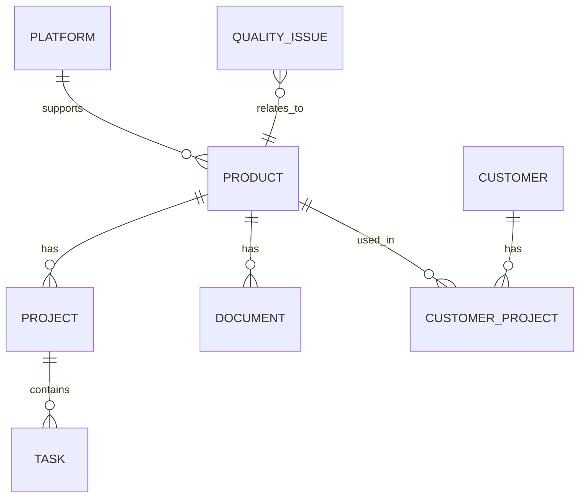

## 1. Architecture Design

```mermaid
graph TB
    subgraph "前端层"
        A[React 应用]
        B[路由管理 react-router-dom]
        C[状态管理 zustand]
        D[UI组件 自定义 + Tailwind]
        E[图表库 Recharts]
    end
    
    subgraph "后端层"
        F[Express API 服务]
        G[业务逻辑处理]
        H[数据验证中间件]
    end
    
    subgraph "数据层"
        I[模拟数据存储]
        J[本地状态管理]
    end
    
    A --> B
    A --> C
    A --> D
    A --> E
    F --> G
    F --> H
    A <--> F
    F <--> I
```

## 2. Technology Description
- **Frontend**: React@18 + TypeScript + tailwindcss@3 + vite
- **Initialization Tool**: vite-init
- **Backend**: Express.js + TypeScript
- **Database**: 前端模拟数据 + Zustand 状态管理（后续可扩展为 Supabase/PostgreSQL）
- **UI 组件**: 自定义组件 + Tailwind CSS
- **图表可视化**: Recharts
- **状态管理**: Zustand
- **路由**: react-router-dom

## 3. Route Definitions
| Route | Purpose |
|-------|---------|
| / | 首页/仪表盘 |
| /strategy | 战略与规划层 - 市场分析与路线图 |
| /execution | 执行与交付层 - 项目管理与文档 |
| /sales | 商业与销售层 - 定价与客户管理 |
| /quality | 质量与风控层 - 质量数据库与追溯 |
| /team | 组织与协作层 - 团队与KPI |

## 4. API Definitions

### 4.1 TypeScript 类型定义

```typescript
// 产品相关类型
interface Product {
  id: string;
  name: string;
  code: string;
  status: 'planning' | 'developing' | 'mass_production' | 'eol';
  platformId?: string;
  description: string;
  targetCost: number;
  targetPerformance: string;
  createdAt: string;
  updatedAt: string;
}

// 项目相关类型
interface Project {
  id: string;
  name: string;
  productId: string;
  status: string;
  startDate: string;
  endDate: string;
  budget: number;
  actualCost: number;
  tasks: Task[];
}

interface Task {
  id: string;
  name: string;
  assignee: string;
  status: 'todo' | 'in_progress' | 'done';
  startDate: string;
  endDate: string;
  progress: number;
}

// 市场分析相关类型
interface MarketData {
  tam: number;
  sam: number;
  som: number;
  year: number;
}

interface Competitor {
  id: string;
  name: string;
  productModel: string;
  price: number;
  performance: Record<string, any>;
  marketShare: number;
}

// 客户相关类型
interface Customer {
  id: string;
  name: string;
  region: string;
  projects: CustomerProject[];
}

interface CustomerProject {
  id: string;
  name: string;
  status: 'design_win' | 'design_in' | 'pending';
  forecastRevenue: number;
}

// 质量相关类型
interface QualityIssue {
  id: string;
  title: string;
  description: string;
  status: 'open' | 'in_progress' | 'resolved' | 'closed';
  severity: 'low' | 'medium' | 'high' | 'critical';
  lotNumber?: string;
  waferLot?: string;
  packageLot?: string;
  createdAt: string;
}

// 文档相关类型
interface Document {
  id: string;
  title: string;
  type: 'datasheet' | 'app_note' | 'test_report' | 'other';
  version: string;
  productId: string;
  url: string;
  createdAt: string;
}
```

### 4.2 API 端点设计

```typescript
// 产品 API
GET /api/products - 获取产品列表
GET /api/products/:id - 获取产品详情
POST /api/products - 创建产品
PUT /api/products/:id - 更新产品
DELETE /api/products/:id - 删除产品

// 项目 API
GET /api/projects - 获取项目列表
GET /api/projects/:id - 获取项目详情
POST /api/projects - 创建项目
PUT /api/projects/:id - 更新项目

// 市场分析 API
GET /api/market-data - 获取市场数据
GET /api/competitors - 获取竞争对手列表

// 客户 API
GET /api/customers - 获取客户列表
GET /api/customers/:id - 获取客户详情

// 质量 API
GET /api/quality-issues - 获取质量问题列表
POST /api/quality-issues - 创建质量问题

// 文档 API
GET /api/documents - 获取文档列表
POST /api/documents - 上传文档
```

## 5. 数据模型

### 5.1 核心实体关系



### 5.2 数据结构设计

使用前端模拟数据，结构如下：

```typescript
interface AppState {
  products: Product[];
  projects: Project[];
  marketData: MarketData[];
  competitors: Competitor[];
  customers: Customer[];
  qualityIssues: QualityIssue[];
  documents: Document[];
  currentUser?: User;
}
```

### 5.3 初始模拟数据

将在项目中提供完整的模拟数据，包括：
- 5个示例产品（不同状态）
- 3个示例项目
- 市场数据（TAM/SAM/SOM）
- 竞争对手数据
- 客户和项目数据
- 质量问题示例
- 文档记录

## 6. 项目结构

```
/workspace
├── src/
│   ├── components/          # 可复用组件
│   │   ├── common/         # 通用组件
│   │   ├── charts/         # 图表组件
│   │   └── layout/         # 布局组件
│   ├── pages/              # 页面组件
│   │   ├── Dashboard/
│   │   ├── Strategy/
│   │   ├── Execution/
│   │   ├── Sales/
│   │   ├── Quality/
│   │   └── Team/
│   ├── hooks/              # 自定义 hooks
│   ├── store/              # Zustand store
│   ├── types/              # TypeScript 类型定义
│   ├── utils/              # 工具函数
│   ├── mock/               # 模拟数据
│   ├── App.tsx
│   ├── main.tsx
│   └── index.css
├── api/                    # Express 后端（可选）
├── package.json
├── tsconfig.json
├── vite.config.ts
├── tailwind.config.js
└── postcss.config.js
```
