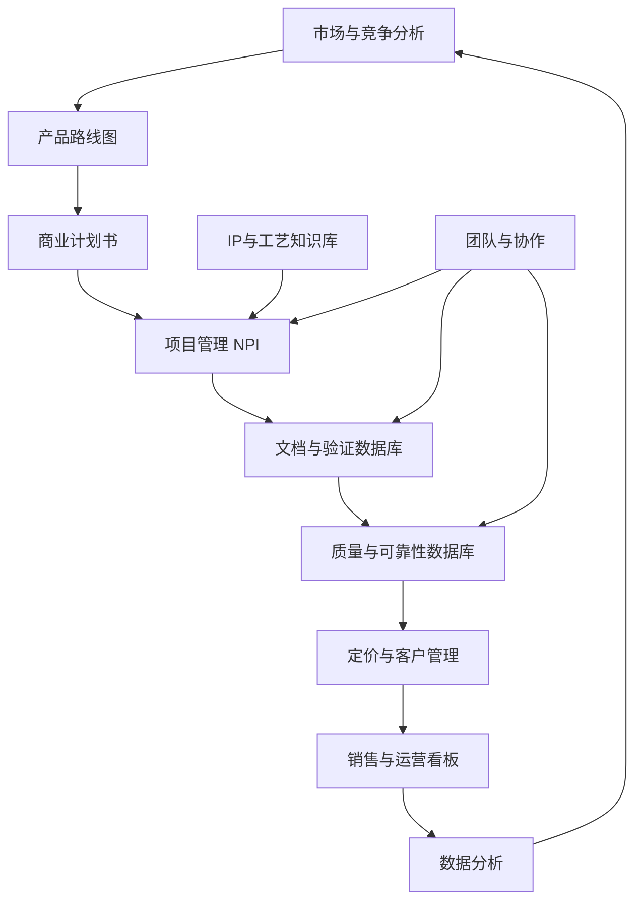

## 1. Product Overview
芯片/电子产品全生命周期数据管理平台，将分散在Excel、邮件、PPT、内部网页中的信息统一为一个以产品为核心、可追溯、可量化、可协作的数据库。
- 主要解决芯片/电子产品从概念到退市全生命周期数据分散、难以追溯、协作效率低的问题
- 目标用户是芯片产品线经理、设计工程师、应用工程师、测试工程师、质量工程师和销售团队
- 市场价值在于提升产品开发效率、降低质量风险、优化产品决策

## 2. Core Features

### 2.1 User Roles
| Role | Registration Method | Core Permissions |
|------|---------------------|------------------|
| 产品线经理 | 企业邮箱注册 | 所有模块访问权限，产品路线图管理，审批流程 |
| 设计工程师 | 企业邮箱注册 | IP与工艺知识库，项目管理，文档验证数据库 |
| 应用工程师 | 企业邮箱注册 | 文档验证数据库，项目管理，客户需求调研 |
| 测试/质量工程师 | 企业邮箱注册 | 质量与可靠性数据库，验证报告库，问题追溯 |
| 销售 | 企业邮箱注册 | 定价与客户管理，销售与运营看板 |

### 2.2 Feature Module
1. **Dashboard**: 产品概览，关键指标卡片，快速导航
2. **战略与规划层**: 市场与竞争分析，产品路线图
3. **执行与交付层**: 商业计划书管理，项目管理(NPI)，文档与验证数据库，IP与工艺知识库
4. **商业与销售层**: 定价与客户管理，销售与运营看板
5. **质量与风控层**: 质量与可靠性数据库，问题追溯
6. **组织与协作层**: 团队与沟通记录，个人KPI看板

### 2.3 Page Details
| Page Name | Module Name | Feature description |
|-----------|-------------|---------------------|
| Dashboard | 概览卡片 | 显示关键业务指标：在研项目数、量产项目数、质量问题数、销售额趋势 |
| Dashboard | 快速导航 | 一键跳转到主要功能模块 |
| Dashboard | 近期活动 | 显示最近更新的项目和任务 |
| 市场与竞争分析 | TAM/SAM/SOM | 可视化展示潜在市场总量、可服务市场、可获得市场 |
| 市场与竞争分析 | 竞争对手数据库 | 竞品型号、价格、性能、市场份额、路线图管理 |
| 市场与竞争分析 | 客户需求调研库 | 客户拜访记录、反馈存储与查询 |
| 产品路线图 | 时间轴视图 | 2-5年产品规划时间轴，代际产品功能、性能、成本目标 |
| 产品路线图 | 平台战略关联 | 产品-平台-衍生品树形结构展示 |
| 产品路线图 | 状态跟踪 | 规划中/研发中/已量产/已EOL状态管理 |
| 商业计划书 | 财务计算 | ASP、COGS、用量预测输入，自动生成毛利、NPV、IRR |
| 商业计划书 | 风险评分 | 商业/技术/竞争/日期风险1-10分量化 |
| 项目管理(NPI) | 甘特图 | 关键节点时间线，拖拽调整，延期预警 |
| 项目管理(NPI) | 任务分解 | 任务分配，负责人，每周进度记录 |
| 项目管理(NPI) | 成本追踪 | 流片、光罩、封测、IP授权支出与预算对比 |
| 文档与验证数据库 | Datasheet管理 | 版本管理，差异对比 |
| 文档与验证数据库 | 验证报告 | 电性能、环境、可靠性测试报告归档 |
| IP与工艺知识库 | IP复用 | 已开发IP记录，工艺节点、代工厂标注 |
| IP与工艺知识库 | 工艺参数 | PDK、Design Rule、良率历史数据存储 |
| 定价与客户管理 | 动态价格表 | 销量阶梯价格，实时毛利计算 |
| 定价与客户管理 | 客户项目看板 | Design Win/Design In/Pending状态管理 |
| 销售与运营看板 | QBR报表 | 区域/产品线/客户销售额、毛利、ASP走势图 |
| 销售与运营看板 | 生产预测 | 销售预测、库存、产能联动预警 |
| 质量与可靠性 | FIT/MTTF追踪 | 加速老化测试数据，澡盆曲线生成 |
| 质量与可靠性 | 8D问题追溯 | 客户投诉问题全链追溯 |
| 团队与协作 | 周会纪要 | 行动项、DDL、任务关联 |
| 团队与协作 | 个人KPI | 量产项目数、节点准时率、质量投诉率 |

## 3. Core Process
产品从概念到退市的全流程数据管理：
1. 战略规划阶段：市场分析→产品路线图制定
2. 商业立项阶段：商业计划书编写→审批→项目立项
3. 研发执行阶段：任务分解→进度跟踪→成本控制→文档管理
4. 质量验证阶段：测试执行→报告归档→问题追溯
5. 销售运营阶段：定价管理→客户管理→销售预测
6. 持续改进：数据分析→下一代产品定义

## 4. User Interface Design
### 4.1 Design Style
- 主色调：深蓝色 (#0F3460) 代表科技感与专业性，辅色调：天蓝色 (#3498DB) 代表创新，强调色：青绿色 (#1ABC9C) 代表成功
- 按钮风格：扁平化设计，圆角8px，带微妙阴影效果
- 字体：Inter作为主字体，清晰易读，标题使用semibold/bold
- 布局风格：侧边导航栏+主内容区的经典企业应用布局
- 图标风格：使用Lucide React线性图标，保持简洁一致
- 视觉风格：专业、科技感、简洁高效，重点突出数据可视化效果

### 4.2 Page Design Overview
| Page Name | Module Name | UI Elements |
|-----------|-------------|-------------|
| Dashboard | 概览卡片 | 渐变背景卡片，数值动画，图标与数值左右布局 |
| Dashboard | 快速导航 | 网格布局，hover高亮效果 |
| 产品路线图 | 时间轴视图 | 水平时间轴，彩色节点标识，拖拽交互 |
| 项目管理 | 甘特图 | 左侧任务列表，右侧时间进度条，支持缩放 |
| 数据可视化 | 图表区域 | 使用Recharts库，多种图表类型（柱状、折线、饼图） |
| 所有页面 | 表格 | 斑马纹，hover高亮，支持排序筛选 |

### 4.3 Responsiveness
- 桌面优先设计，适配1920×1080及以上分辨率
- 响应式布局支持平板和移动设备，导航栏在小屏幕自动折叠
- 触摸优化：按钮和可点击区域最小48px

### 4.4 数据可视化指导
- 使用Recharts库实现高性能图表渲染
- 关键指标使用卡片式展示，带趋势箭头
- 路线图使用时间轴组件，支持缩放和拖拽
- 甘特图使用专用组件展示项目进度
- 所有图表支持数据导出功能
